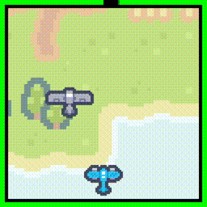

# Chiccha Engine

Chiccha Engine は、ミニゲームを作るための小さなゲームエンジンです。
画像やスクリプトを含むアセットをランタイムで読み込んで、ブラウザ上でゲームを実行することができます。



ソースコードは MIT ライセンスの元で公開されていますが、実験的なプロジェクトです。他の開発者が利用することを前提としていませんので、ご了承ください。

`./demo` ディレクトリにサンプルプロジェクトが含まれています。

# Development

install dependencies.

```sh
pnpm install
```

build and watch `Chiccha Engine`.

```sh
pnpm dev
```

host demo server.

```sh
cd demo
pnpm dev
```

and open `http://localhost:5173`.

# Documentation

## 実行方法

ゲームのプロジェクトは JSON ファイルで管理され、画像やスクリプトはネットワーク上に配置されている必要があります。

例として、下記のようなコードでゲームを実行することができます。

```typescript
async function main() {
  const canvas = document.getElementById("canvas");

  const gameProject = await fetch("/path/to/project.json").then((res) =>
    res.json()
  );

  GameRunner.instance.initialize({
    assetManager: new AssetManager(gameProject),
    gameObjects: gameProject.gameObjects.map((gameObject) => {
      return GameObject.fromJSON(gameObject);
    }),
    ctx: canvas.getContext("2d"),
  });

  const mainLoop = () => {
    GameRunner.instance.update();
    GameRunner.instance.render();
    requestAnimationFrame(mainLoop);
  };

  GameRunner.instance.start().then(() => {
    mainLoop();
  });
}
```

## スキーマ

ゲームプロジェクトのスキーマは以下の通りです。

**GameProject**

| name        | type         | description                |
| ----------- | ------------ | -------------------------- |
| id          | string       | プロジェクトの ID          |
| name        | string       | プロジェクトの名前         |
| assets      | Asset[]      | アセットのリスト           |
| gameObjects | GameObject[] | ゲームオブジェクトのリスト |

**Asset**

| name | type   | description    |
| ---- | ------ | -------------- |
| id   | string | アセットの ID  |
| type | string | アセットの種類 |

**ImageAsset**

Asset の種類が "ImageAsset" の場合

| name | type         | description                  |
| ---- | ------------ | ---------------------------- |
| id   | string       | アセットの ID                |
| type | "ImageAsset" | シリアライズするための識別名 |
| src  | string       | 画像の URL                   |

**ScriptAsset**

Asset の種類が "ScriptAsset" の場合

| name | type          | description                  |
| ---- | ------------- | ---------------------------- |
| id   | string        | アセットの ID                |
| type | "ScriptAsset" | シリアライズするための識別名 |
| src  | string        | スクリプトの URL             |

**GameObject**

| name       | type        | description              |
| ---------- | ----------- | ------------------------ |
| id         | string      | ゲームオブジェクトの ID  |
| name       | string      | ゲームオブジェクトの名前 |
| components | Component[] | コンポーネントのリスト   |

**Component**

| name | type   | description          |
| ---- | ------ | -------------------- |
| id   | string | コンポーネントの ID  |
| type | string | コンポーネントの種類 |

**TransformComponent**

Component の種類が "TransformComponent" の場合

| name     | type                     | description                  |
| -------- | ------------------------ | ---------------------------- |
| id       | string                   | コンポーネントの ID          |
| type     | "TransformComponent"     | シリアライズするための識別名 |
| position | { x: number, y: number } | 位置                         |

**ImageRenderer**

Component の種類が "ImageRenderer" の場合

| name            | type             | description                  |
| --------------- | ---------------- | ---------------------------- |
| id              | string           | コンポーネントの ID          |
| type            | "ImageComponent" | シリアライズするための識別名 |
| imageId         | string           | 画像の ID                    |
| rotation        | number           | 回転                         |
| flipX           | boolean          | X 軸の反転                   |
| flipY           | boolean          | Y 軸の反転                   |
| enableCollision | boolean          | 衝突判定の有効化             |

**ScriptComponent**

Component の種類が "ScriptComponent" の場合

| name     | type              | description                  |
| -------- | ----------------- | ---------------------------- |
| id       | string            | コンポーネントの ID          |
| type     | "ScriptComponent" | シリアライズするための識別名 |
| scriptId | string            | スクリプトの ID              |

## Lua Script

Lua スクリプトは、以下のように関数を持ったテーブルを返す必要があります。

```lua
return {
  onStart = function(self)
    -- start
  end,

  onUpdate = function(self)
    self.moveX(1)
  end,

  onCollisionEnter_player = function(self, other)
    self.gameOver()
  end,
}
```

ScriptAsset に記述された Lua スクリプトは、以下の API を使用することができます。

- `moveX(x: number)`
  - Move the entity along the x-axis.
- `moveY(y: number)`
  - Move the entity along the y-axis.
- `changeImage(imageId: string)`
  - Change the image of the entity.
- `gameClear()`
  - Clear the game.
- `gameOver()`
  - Game over.
- `onUpdate()`
  - Register the update function.
- `onStart()`
  - Register the start function.
- `onKey[Down|Up|Press]_[keyName]`
  - Register the key event function.
- `onCollisionEnter_[name]`
  - Register the collision enter function.
- `random(min: number, max: number)`
  - Generate a random number.

# License

Source code is licensed under the MIT license.

## Font

### x8y12pxTheStrongGamer.ttf

https://hicchicc.github.io/00ff/

```
フォント制作・著作 / Webサイト制作・管理
© 2018-2024 hicc 患者長ひっく
```

## Image

### Pixel Shmup (1.1)

https://kenney.nl/assets/pixel-shmup

```
Pixel Shmup (1.1)

	Created/distributed by Kenney (www.kenney.nl)
	Creation date: 01-11-2021

			------------------------------

	License: (Creative Commons Zero, CC0)
	http://creativecommons.org/publicdomain/zero/1.0/

	This content is free to use in personal, educational and commercial projects.

	Support us by crediting Kenney or www.kenney.nl (this is not mandatory)

			------------------------------

	Donate:   http://support.kenney.nl
	Patreon:  http://patreon.com/kenney/

	Follow on Twitter for updates:
	http://twitter.com/KenneyNL
```
